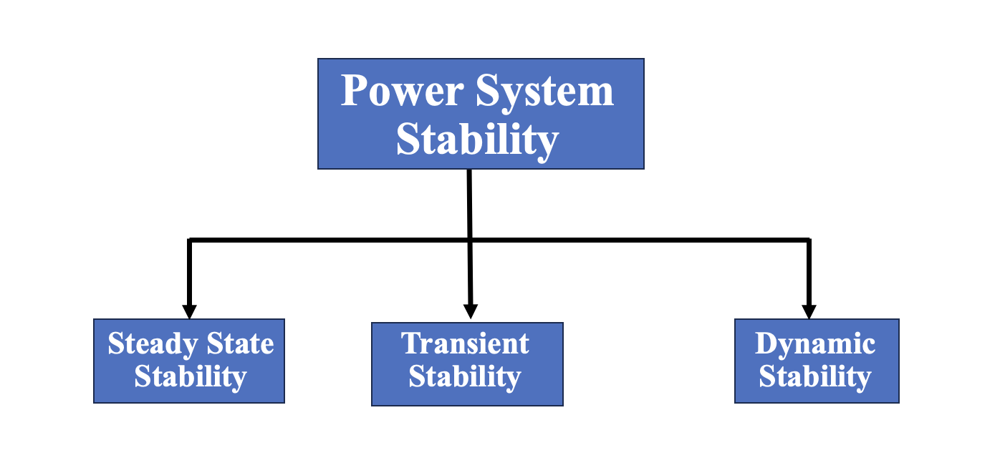

<h3>Introduction</h3>

The stability of a system refers to the ability of a system to return back to its steady state when subjected to a disturbance. The power is generated by synchronous generators that operate in synchronism with the rest of the system. A generator is synchronized with a bus when both of them have same frequency, voltage and phase sequence. We can thus define the power system stability as the ability of the power system to return to steady state without losing synchronism.   

Power system stability is categorized into Steady state, Transient and Dynamic stability. 

 

<b>Fig.1 Types of power system stability</b>
 

<b>Steady State Stability: </b> Its studies are restricted to small and gradual changes in the system operating conditions. In this we basically concentrate on restricting the bus voltages close to their nominal values. We also ensure that phase angles between two buses are not too large and check for the overloading of the power equipment and transmission lines. These checks are usually done using power flow studies.

<b>Transient Stability: </b> It involves the study of the power system following a major disturbance. Following a large disturbance the synchronous alternator the machine power (load) angle changes due to sudden acceleration of the rotor shaft. The objective of the transient stability study is to ascertain whether the load angle returns to a steady value following the clearance of the disturbance.

<b>Dynamic Stability: </b> The ability of a power system to maintain stability under continuous small disturbances, also known as small-signal stability. These small disturbances occur due random fluctuations in loads and generation levels. In an interconnected power system, these random variations can lead catastrophic failure as this may force the rotor angle to increase steadily.

<a href="docs/exp-6.pdf" target="_blank">Click here for the detailed theory explanation</a>