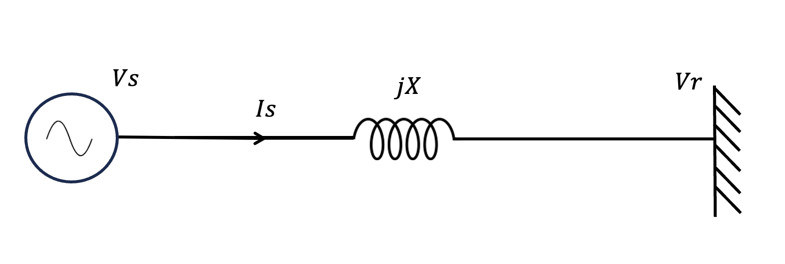
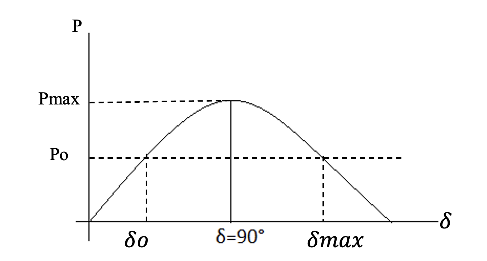
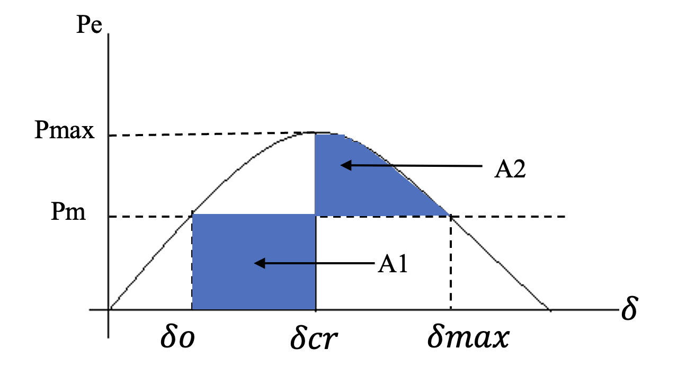
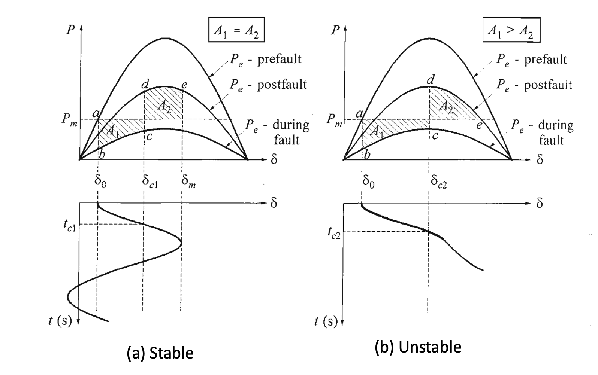

<h2>Theory</h2>

The stability of a system refers to the ability of a system to return back to its steady state when subjected to a disturbance. The power is generated by synchronous generators that operate in synchronism with the rest of the system. A generator is synchronized with a bus when both of them have same frequency, voltage and phase sequence. We can thus define the power system stability as the ability of the power system to return to steady state without losing synchronism.   

Power system stability is categorized into Steady state, Transient and Dynamic stability. 

 

<b>Fig.1 Types of power system stability</b>
 

<b>Steady State Stability: </b> It studies are restricted to small and gradual changes in the system operating conditions. In this we basically concentrate on restricting the bus voltages close to their nominal values. We also ensure that phase angles between two buses are not too large and check for the overloading of the power equipment and transmission lines. These checks are usually done using power flow studies.

<b>Transient Stability: </b> It involves the study of the power system following a major disturbance. Following a large disturbance the synchronous alternator the machine power (load) angle changes due to sudden acceleration of the rotor shaft. The objective of the transient stability study is to ascertain whether the load angle returns to a steady value following the clearance of the disturbance.

<b>Dynamic Stability: </b> The ability of a power system to maintain stability under continuous small disturbances, also known as small-signal stability. These small disturbances occur due random fluctuations in loads and generation levels. In an interconnected power system, these random variations can lead catastrophic failure as this may force the rotor angle to increase steadily.

In this lab, we will be discussing the transient stability of a grid connected synchronous machine. For studying the transient stability phenomenon, a simplified lossless is considered. The schematic of single-machine-infinite-bus (SMIB) system is shown in Fig. 2.

 

<b>Fig. 2 Single line diagram of an SMIB system</b>
 

In this system, the reactance $(X)$ represents the combined reactance of the transmission line and the generator's synchronous or transient reactance. The voltage at the sending end is the generator's internal EMF. The sending end voltage is $(V_{s}\angle\delta)$ and receiving end voltage is $(V_{r}\angle0)$  For a lossless transmission line, the real power at the sending end is the same as the real power at the receiving end. The real power $(P)$ transmitted is given by:

$$
\begin{equation}
    P = \frac{V_{s}V_{r}sin\delta}{X}
\end{equation}
$$

$$
\begin{equation}
    P = P_{max}sin\delta
\end{equation}
$$

where, $P_{max}=\frac{V_{s}V_{r}}{X} $ is the maximum power that can be transmitted. $(\delta)$ is the power angle, which is the phase difference between the sending and receiving voltages.

The power-angle curve, shown in Fig. 3, illustrates how power varies with $(\delta)$ . For a given power $P=P_{o}$ there are two possible values of $(\delta)$: $\delta_{o} = sin^{-1}(\frac{P_{o}}{P_{max}})$ and $\delta_{max}= 180^{o} - \delta_{o}$.

 

<b>Fig. 3 Power angle curve</b>
 

The swing equation is given by: 

$$
\begin{equation}
J\frac{\mathrm{d^2 \delta} }{\mathrm{d} t^2}=P_{m}-P_{e}=P_{a}
\end{equation}
$$

In per unit it is mathematically represented as follows:

$$
\begin{equation}
\frac{2H}{w_{s}}\frac{\mathrm{d^2 \delta} }{\mathrm{d} t^2}=P_{m}-P_{e}=P_{a}
\end{equation}
$$

The real power transmitted over a lossless line is given by (1). Now consider the situation in which the synchronous machine is operating in steady state delivering a power $(P_{e})$ equal to $(P_{m})$ when there is a fault occurs in the system. Opening up of the circuit breakers in the faulted section subsequently clears the fault. The circuit breakers take about 5/6 cycles to open and the subsequent post-fault transient last for another few cycles. The input power, on the other hand, is supplied by a prime mover that is usually driven by a steam turbine. The time constant of the turbine mass system is of the order of few seconds, while the electrical system time constant is in milliseconds. Therefore, for all practical purpose, the mechanical power is remains constant during this period when the electrical transients occur. The transient stability study therefore concentrates on the ability of the power system to recover from the fault and deliver the constant power $(P_{m})$ with a possible new load angle $(\delta)$.
Consider the power angle curve shown in Fig. 4. Suppose the system of Fig. 2 is operating in the steady state delivering a power of $(P_{m})$ at an angle of $(\delta_{o})$ when due to malfunction of the line, circuit breakers open reducing the real power transferred to zero. Since $(P_{m})$ remains constant, the accelerating power $(P_{a})$ becomes equal to $(P_{m})$. The difference in the power gives rise to the rate of change of stored kinetic energy in the rotor masses. Thus the rotor will accelerate under the constant influence of non-zero accelerating power and hence the load angle will increase. Now suppose the circuit breaker re-closes at an angle $(\delta_{c})$. The power will then revert back to the normal operating curve. At that point, the electrical power will be more than the mechanical power and the accelerating power will be negative. This will cause the machine decelerate. However, due to the inertia of the rotor masses, the load angle will still keep on increasing. The increase in this angle may eventually stop and the rotor may start decelerating, otherwise the system will lose synchronism.

 

<b>Fig. 4 Power angle curve for equal area criteria</b>
 

Note that:
$$
\begin{equation}
\frac {d}{dt} \Big (\frac {d\delta} {dt}\Big) ^2 = 2 \frac {d\delta} {dt} \Big(\frac{d^2\delta}{dt^2} \Big) 
\end{equation}
$$

Hence multiplying both sides of (4) by $$ \Big (\frac{d\delta}{dt}\Big)$$ and rearranging we get

$$\frac{H}{w_s} \frac{d}{dt} \Big (\frac{d\delta}{dt}\Big)^2 = (P_m-P_e) \Big (\frac{d\delta}{dt}\Big)$$

Multiplying both sides of the above equation by $(dt)$ and then integrating between two arbitrary angles $(\delta_{o})$ and $(\delta_{c})$, we get

$$
\begin{equation}
\frac{H}{w_s} \Big(\frac{d\delta}{dt}\Big)^2 \Biggr|_{\delta_{o}} ^{\delta_{c}}  = \int_{\delta_o}^{\delta_c}(P_{m}-P_e)d \delta
\end{equation}
$$

Now suppose the generator is at rest at $(\delta_{o})$. We then have $\frac{d\delta}{dt}=0$. Once a fault occurs, the machine starts accelerating. Once the fault is cleared, the machine keeps on accelerating before it reaches its peak at $(\delta_{c})$, at which point we again have $\frac{d\delta}{dt}=0$. Thus the area of accelerating is given from (7) as

$$
\begin{equation}
A1 = \int_{\delta_o}^{\delta_c}(P_m-P_e)d \delta =0
\end{equation}
$$

In a similar way, we can define the area of deceleration. In Fig. 4, the area of acceleration is given by $A1$ while the area of deceleration is given by $A2$. This is given by

$$
\begin{equation}
A2 = \int_{\delta_{c}}^{\delta_{max}}(P_{e}-P_{m})d \delta =0
\end{equation}
$$

Now consider the case when the line is reclosed at $(\delta_{c})$ such that the area of acceleration is larger than the area of deceleration, i.e., $A1>A2$ . The generator load angle will then cross the point $(\delta_{max})$ beyond which the electrical power will be less than the mechanical power forcing the accelerating power to be positive. The generator will therefore start accelerating before is slows down completely and will eventually become unstable as shown in Fig. 5. If, on the other hand, $A1<A2$  , i.e., the decelerating area is larger than the accelerating area, the machine will decelerate completely before accelerating again. The rotor inertia will force the subsequent acceleration and deceleration areas to be smaller than the first ones and the machine will eventually attain the steady state as shown in Fig. 5. If the two areas are equal, i.e., $A1=A2$  , then the accelerating area is equal to decelerating area and this is defines the boundary of the stability limit. The clearing angle $(\delta_{c})$, for this mode is called the Critical Clearing Angle and is denoted by $(\delta_{cr})$. We then get from Fig. 4 by substituting $(\delta_{c}=\delta_{cr})$

$$
\begin{equation}
\int_{\delta_{o}}^{\delta_{c}}(P_{m}-P_{e})d \delta= \int_{\delta_{c}}^{\delta_{max}}(P_{e}-P_{m})d \delta
\end{equation}
$$

We can calculate the critical clearing angle from the ab move equation. Since the critical clearing angle depends on the equality of the areas, this is called the equal area criterion.

 

<b>Fig. 5 (a) Stable case when A1=A2 and (b) Unstable case when A1>A2.</b>
 

